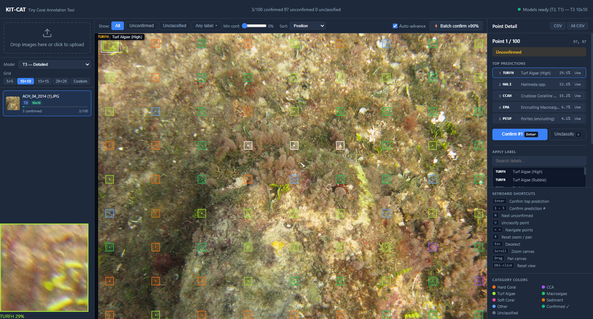

# KIT-CAT | Keep it Tiny - Coral Annotation Tool

> A Tiny Tool for Rapid Point/Patch Benthic Annotation



KIT-CAT is a self-contained, browser-based annotation tool for classifying benthic habitat in reef photos. Upload images, a YOLO11 classifier automatically scores a configurable point grid, and you confirm, override, or relabel predictions — then export to CSV.

## Quick Start

### Requirements

- Docker and Docker Compose
- YOLO11 model weights placed in `models/`

### Run

```bash
docker compose up --build
```

Then open **http://localhost:8000** in your browser.

### Model files

Download pre-trained weights from HuggingFace:

| Model | HuggingFace Repo |
|-------|-----------------|
| T3 — detailed 60+ category classifier | [NMFS-OSI/yolo11m-cls-noaa-pacific-benthic-cover-t3](https://huggingface.co/NMFS-OSI/yolo11m-cls-noaa-pacific-benthic-cover-t3) |
| T1 — coarse category classifier | [NMFS-OSI/yolo11m-cls-noaa-pacific-benthic-cover-t1](https://huggingface.co/NMFS-OSI/yolo11m-cls-noaa-pacific-benthic-cover-t1) |

Both paths can be overridden with environment variables `MODEL_T3` and `MODEL_T1`.

---

## Usage

### 1. Upload images

Drag and drop one or many images onto the left sidebar, or click to open a file picker. Before uploading, configure:

- **Model** — T3 (detailed) or T1 (coarse)
- **Grid** — choose a preset or enter custom rows × cols

Each image is classified automatically. Per-file status badges show progress.

### 2. Annotate points

Click any point on the image to open the detail panel. From there:

- **Confirm** a machine prediction (top prediction or any of the top 5)
- **Apply a label** — search the full label list or create a new custom label
- **Unclassify** a point to reset it

Use **Batch confirm ≥ 90%** to auto-confirm all high-confidence unconfirmed points.

### 3. Filter and navigate

Use the toolbar to filter what points are shown on the map:

- **Show:** All / Unconfirmed / Unclassified
- **Labels:** select one or more label codes to show only matching points
- **Min conf:** hide points below a confidence threshold
- **Sort:** navigate points by Position, Label, or Confidence

### 4. Export

Click **CSV** to download annotations for the current image, or **All CSV** for every image in the session. Exports include all annotation details plus `model_used`, `grid_rows`, `grid_cols`, and `is_custom_label`.

---

## Keyboard Shortcuts

| Key | Action |
|-----|--------|
| `Enter` | Confirm top prediction |
| `1` – `5` | Confirm prediction #1–5 |
| `N` | Jump to next unconfirmed |
| `U` | Unclassify selected point |
| `← →` | Navigate points (respects active filter/sort) |
| `R` | Reset zoom and pan |
| `Esc` | Deselect point |
| `Scroll` | Zoom in/out (anchored to cursor) |
| `Drag` | Pan image |
| `Dbl-click` | Reset view |

---

## Project Structure

```
kit-cat/
├── main.py              # FastAPI backend — inference, API, label store
├── requirements.txt
├── Dockerfile
├── docker-compose.yml
├── models/
│   ├── yolo11m_cls_noaa-pacific-benthic-t3.pt
│   └── yolo11m_cls_noaa-pacific-benthic-t.pt
└── static/
    ├── index.html       # Single-page app shell
    ├── app.js           # All client logic
    └── style.css        # Dark-theme styles
```

----------
#### Disclaimer
This repository is a scientific product and is not official communication of the National Oceanic and Atmospheric Administration, or the United States Department of Commerce. All NOAA GitHub project content is provided on an ‘as is’ basis and the user assumes responsibility for its use. Any claims against the Department of Commerce or Department of Commerce bureaus stemming from the use of this GitHub project will be governed by all applicable Federal law. Any reference to specific commercial products, processes, or services by service mark, trademark, manufacturer, or otherwise, does not constitute or imply their endorsement, recommendation or favoring by the Department of Commerce. The Department of Commerce seal and logo, or the seal and logo of a DOC bureau, shall not be used in any manner to imply endorsement of any commercial product or activity by DOC or the United States Government.

#### License
This repository's code is available under the terms specified in [LICENSE.md](./LICENSE.md).